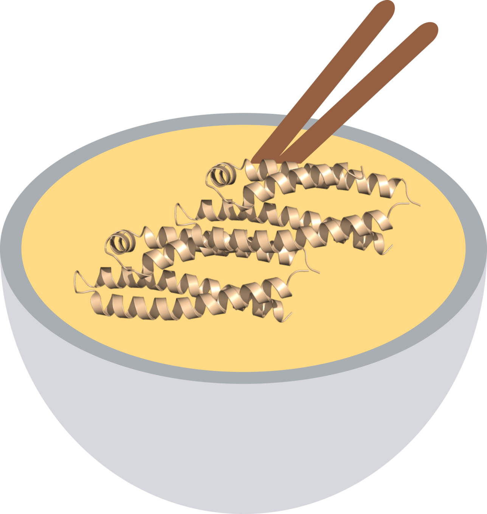

# UdonPred: Untangling Protein Intrinsic Disorder Prediction


**UdonPred** is a set of models for predicting disorder based on different definitions of disorder, reaching state-of-the-art performance using simple, [ProstT5](https://github.com/mheinzinger/ProstT5)-based embeddings.
The ability of models trained on one definition of disorder to generalize to others was assessed in the corresponding [publication](https://doi.org/10.64898/2026.01.26.701679).

The training data can be found [here](https://doi.org/10.6084/m9.figshare.31444642).

For the old version submitted to CAID3 go to [https://github.com/jschlensok/udonpred](https://github.com/jschlensok/udonpred).

## Installation
```
git clone https://github.com/davidwagemann/udonpred.git && cd udonpred
uv sync --extra embedding
```
Plain `uv sync` installs only the lean, torch-free inference core. Extras: `embedding` (ProstT5 via
`torch` + `transformers`), `training` (includes `embedding`), and `hub` (Hugging Face Hub downloads,
bundled with the other extras).

## Prediction
```
uv run udonpred-predict input.fasta --target all --output out/
```
The ONNX prediction heads are pulled from [`udonpred/prediction-heads`](https://huggingface.co/udonpred/prediction-heads)
at the pinned release and cached. Pass a local directory as the second argument to run offline, or a Hub repo
id (with `--revision`) to use a different set.

Options:
- `--target`: one or more of trizod, trizod2, chezod, softdis, pdbflex, atlas, plddt, disprot, or `all` (default: trizod).
- `--output`: output directory; predictions go to stdout if unset.
- `--normalize` / `--no-normalize`: map scores onto `[0, 1]`, higher = more disordered (default: enabled). See below.
- `--smooth`: Gaussian smoothing sigma (default: 1.5; 0 disables).
- `--batch-size`: total residues per batch (default: 2000); reduce it if you run out of memory.
- `--device`: auto, cpu, or cuda (default: auto). `--threads`: CPU thread cap for the ONNX heads.

**Output:** one directory per head holding one file per protein, `<output>/<target>/<protein>.caid`. Each row is
`<index>\t<residue>\t<score>\t<binary>`:
```
out/chezod/P04637.caid
    >P04637
    1	M	0.892	1
    2	E	0.813	1
```
Filenames come from the FASTA header, with `/`, `|`, and whitespace replaced by `_`. Each head's directory also
gets a `timings.csv` with per-protein execution times in milliseconds (the shared embedding cost is charged to
every head). Without `--output`, predictions go to stdout, prefixed by `# target: <name>` when several heads run.

### Scores and binary calls
Four heads end in a sigmoid; the rest are unbounded regressions on their target's own scale, and
`chezod`/`plddt` run the other way (higher = more ordered). Both output columns come from `TARGET_POLICIES` in
[`src/udonpred/inference.py`](src/udonpred/inference.py):

| head | raw output | score transform | disordered when |
| --- | --- | --- | --- |
| `trizod`, `trizod2` | `[0, 1]` (sigmoid) | none | `x ≥ 0.4` |
| `disprot` | `[0, 1]` (sigmoid) | none | `x ≥ 0.5` |
| `softdis` | `[0, 1]` (sigmoid) | none | `x ≥ 0.025` |
| `chezod` | Z-score (higher = order) | `1 - (clamp(x, -5, 16.15) + 5) / 21.15` | `x < 3` |
| `plddt` | pLDDT (higher = order) | `1 - clamp(x, 0, 100) / 100` | `x < 68.8` |
| `pdbflex` | Å RMSD | `clamp(x, 0, 10) / 10` | `x ≥ 2` |
| `atlas` | Å RMSF | `clamp(x, 0, 10) / 10` | `x ≥ 2` |

Scores are smoothed on the raw scale first, then thresholded (in raw units, so the binary column is the same
with or without `--normalize`), then rescaled. The bounds are fixed, so a residue's score never depends on the
other proteins in the run.

## Embeddings
`udonpred-embed` writes per-residue ProstT5 (`Rostlab/ProstT5_fp16`, `<AA2fold>` direction) embeddings of shape
`(L, 1024)`, float32, with ambiguous residues (`B, Z, J, U, O, *`) mapped to `X`, keyed by FASTA header:
```
uv run udonpred-embed input.fasta --output embeddings.h5   # or .npy for a single sequence
```
Add `--push-to-hub --dataset <target> --split <split>` to upload them to the dataset repo (see below).

## Retraining
Install the training stack with `uv sync --extra training`, fetch the datasets into `data/split/` with
`scripts/fetch_data.sh` (the container launchers below do this themselves), and start training with `uv run udonpred-train train` (or `optimize` for a
hyperparameter search). The data, training, and architecture settings live in `config/data.yaml`,
`config/config.yaml`, and `config/architecture.yaml`. Set `min_length` in `config/config.yaml` to drop short
proteins from training and evaluation.

To train each target × pLM combination separately in a GPU container, submit
`IMAGE=<enroot image> sbatch scripts/slurm/train.sbatch` from the repo root (a Slurm job array via enroot/pyxis;
export `WANDB_API_KEY` first), or run `SCRATCH=<local dir> scripts/docker/train.sh` (the same matrix via
`docker run --gpus`). Both run `scripts/run_training.sh`. With a root Docker daemon, run from a local disk rather
than an NFS home; `DEST=<local dir> scripts/docker/stage.sh` copies the working tree there. Each script's header
lists its other overrides.

Export the trained checkpoints to ONNX and publish them to the Hub in one step:
```
uv run udonpred-export <checkpoint-root> -o exported/ --push-to-hub --tag <version>
```
then bump `DEFAULT_HEADS_REVISION` in [`src/udonpred/heads.py`](src/udonpred/heads.py) to the new tag. Omit
`--push-to-hub` to export locally only.

### Datasets on the Hub
[`udonpred/datasets`](https://huggingface.co/datasets/udonpred/datasets) holds one config per target, with
`train`/`valid`/`test` as jsonl (`{id, y, x_0}`) + FASTA and precomputed embeddings at
`<target>/embeddings/<plm>/<split>.h5`:
```python
from datasets import load_dataset
ds = load_dataset("udonpred/datasets", "trizod")
```
With `embeddings.source: auto` in `config/config.yaml`, training uses these precomputed embeddings when they exist
and computes the rest on the fly. `uv run udonpred-publish-dataset data/split` uploads the jsonl+FASTA splits.

## How to Cite
```
@article {UdonPred,
	author = {Schlensok, Julius and Wagemann, David and Senoner, Tobias and Haak, Markus and Rost, Burkhard},
	title = {UdonPred: Untangling Protein Intrinsic Disorder Prediction},
	elocation-id = {2026.01.26.701679},
	year = {2026},
	doi = {10.64898/2026.01.26.701679},
	publisher = {Cold Spring Harbor Laboratory},
	URL = {https://www.biorxiv.org/content/early/2026/01/28/2026.01.26.701679},
	eprint = {https://www.biorxiv.org/content/early/2026/01/28/2026.01.26.701679.full.pdf},
	journal = {bioRxiv}
}
```
